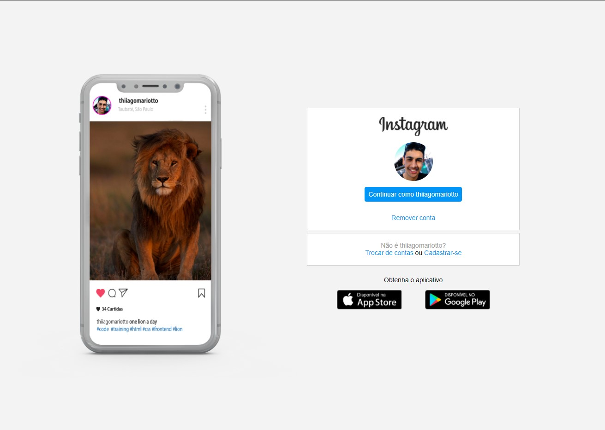

# Instagram Login Page

## Table of Contents

- [About](#about)
- [Getting Started](#getting_started)
- [Preview](#preview)

## About 

The intention of this project was to put knowledge about CSS Flexbox into practice.

## Getting Started 

Clone the repository and open the index.html page inside the pages/login folder

### Prerequisites

Browser

### Preview 
